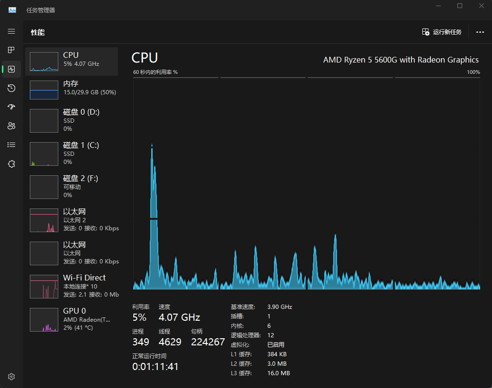
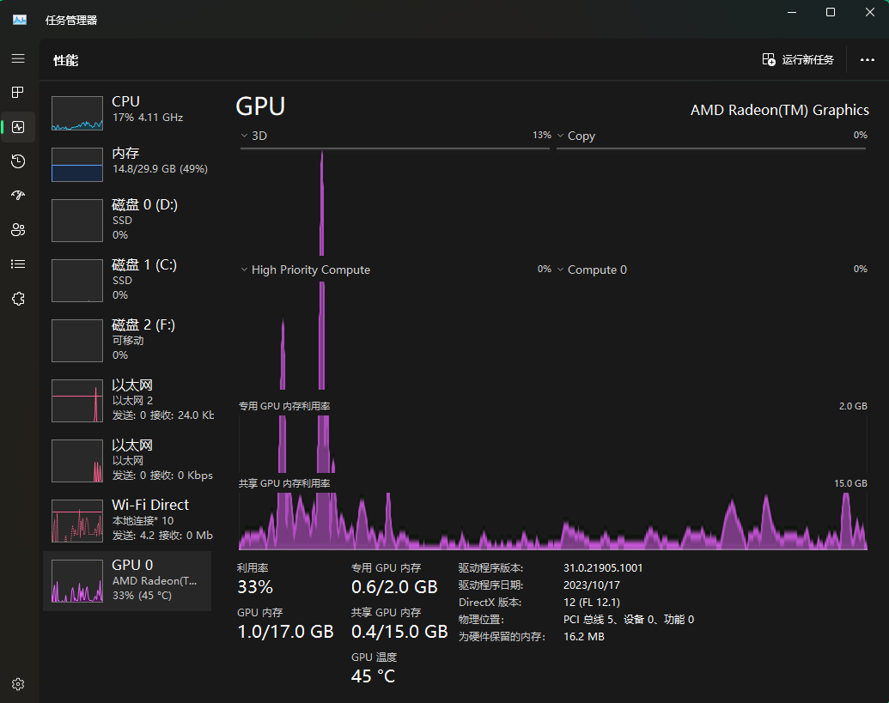
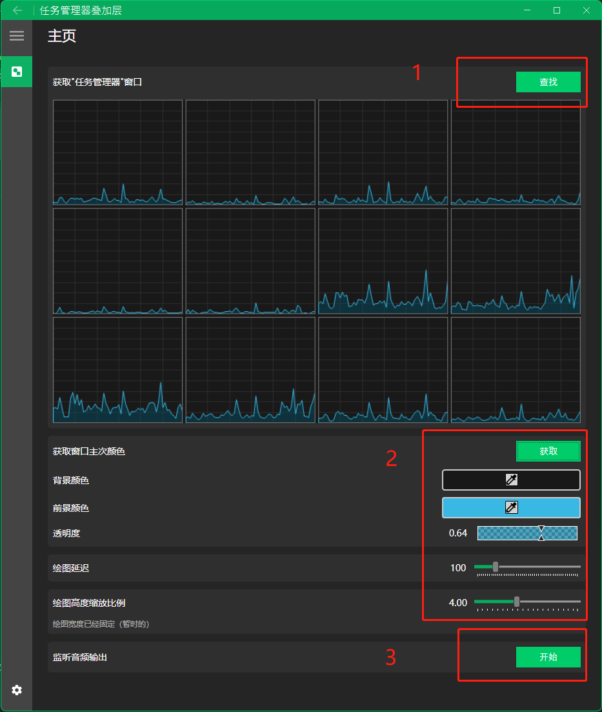

# TaskmgrOverlay

音频可视化，但是是显示在任务管理器

Audio visualization, but displayed in task manager

~~有空再搞 Bad Apple~~





## 如何使用 / How to use



- 0: 打开任务管理器 / Open Taskmgr
- 1: 查找“任务管理器”性能标签窗口 / Find "Taskmgr" performance tag window
- 2: 可选操作 / Optional operation
    - 获取窗口主次颜色 / Get the primary and secondary colors of the window
    - 可自行修改窗口主次颜色 / Modify the primary and secondary colors of the window
    - 修改透明度 / Modify transparency
    - 修改绘图延迟 / Modify drawing delay
    - 修改绘图高度缩放比例 / Modify drawing height scale
- 3: 开始监听系统音频输出 / Start capturing system audio output
- 4: 来点音乐 / Play some music
- 5: 查看任务管理器的窗口变化 / See the changes of the Taskmgr window

## 安装和运行

- 系统要求 / System requirements
    - Windows 11
    - ```Warning``` Windows 10 及以下暂不支持 / Windows 10 and below is not supported

- .Net Core 8.0 
    - 程序已经集成 .Net Core 8.0 运行时 / The program has integrated .Net Core 8.0 runtime
    - 如果提示运行时错误，可下载安装 .Net Core 8.0 运行时环境 / If you get runtime error, download runtime from here
        - [.NET Desktop Runtime 8.0.1](https://dotnet.microsoft.com/en-us/download/dotnet/thank-you/runtime-desktop-8.0.1-windows-x64-installer)

# OverlayLibrary

负责音频可视化的核心功能库 / Core functionality library for audio visualization

## WindowHandleTool.cs

- 负责查找“任务管理器”的窗口句柄 / Find the window handle of the Taskmgr
- 在对应的窗口句柄上绘制图片 / Draw the image on the corresponding window handle

## ImageHelper.cs

- 在对应的屏幕区域截图 / Take a screenshot of the corresponding screen area
- 调整图片、分割图片以及提取颜色 / Adjust the image, split the image, and extract the color

## AudioCaptureAndVisualization.cs

- 监听系统音频输出 / Capture system  audio output
- 绘制音频可视化的图片 / Draw audio visualization image

## 使用示例 / Examples

可直接参考 TaskmgrOverlay/ViewModels/MainViewModel.cs

See the examples in TaskmgrOverlay/ViewModels/MainViewModel.cs


``` csharp
using OverlayLibrary;

var CvChartWindowList = WindowHandleTool.GetCvChartWindowList();
var MaxCurveWindowRECT = CvChartWindowList.CalcMaxCurveWindowRECT();

var WaveCurvePen = new System.Drawing.Pen(System.Drawing.Color.FromArgb(255, 57, 184, 227), 2.0f);
var WaveCurveBackgroundColor = System.Drawing.Color.FromArgb(255, 25, 25, 25);

AudioCaptureAndVisualization.StartAudioCapture();
Task.Run(async () =>
{
    while (AudioCaptureAndVisualization.IsRecording)
    {
        await Task.Delay(100).ConfigureAwait(false);

        if (MaxCurveWindowRECT == Vanara.PInvoke.RECT.Empty || CvChartWindowList.Count == 0) continue;

        System.Drawing.Bitmap waveCurveBitmap = AudioCaptureAndVisualization.GetWaveCurve(MaxCurveWindowRECT.Width, MaxCurveWindowRECT.Height, WaveCurvePen, WaveCurveBackgroundColor, (int)(0.64 * 255));
        if (waveCurveBitmap == null) continue;
        System.Drawing.Bitmap adjustedImage = ImageHelper.AdjustImage(waveCurveBitmap, MaxCurveWindowRECT, DisplayMode.Fill, Alignment.Center);
        for (int i = 0; i < CvChartWindowList.Count; i++)
        {
            Vanara.PInvoke.HWND windowHandle = CvChartWindowList[i].Item1;
            Vanara.PInvoke.RECT rectangle = CvChartWindowList[i].Item2;
            System.Drawing.Bitmap cropImage = ImageHelper.CropImage(adjustedImage, rectangle, MaxCurveWindowRECT.X, MaxCurveWindowRECT.Y);
            WindowHandleTool.ShowImage(windowHandle, cropImage);
        }
    }
});
```
